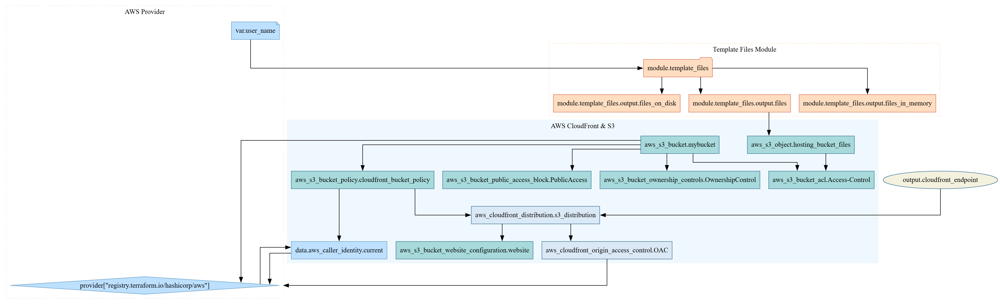

# My Portfolio Website

### Static Website Hosting on AWS S3 with CloudFront Distribution

This project demonstrates the deployment of a highly available, secure, and scalable static website using AWS services such as Amazon S3 and CloudFront, all provisioned and managed with Terraform. The configuration ensures secure content delivery over HTTPS using CloudFront's default certificate, with the flexibility to scale and serve the static website globally.

---

### **Features**

**1. Static Website Hosting on Amazon S3:**
- Hosted static files (HTML, CSS, JS) in an S3 bucket with public access blocked for security.
- Configured the S3 bucket for static website hosting with custom error and index document support.

**2. CloudFront Distribution for HTTPS:**
- Integrated Amazon CloudFront for fast, secure content delivery to a global audience.
- Automatically redirects HTTP traffic to HTTPS for secure access to the website.
- Used CloudFront's Origin Access Control (OAC) to restrict direct S3 access and ensure that all traffic to the S3 bucket flows through CloudFront.

**3. Security & Access Control:**
- Blocked all public access to the S3 bucket using an S3 Bucket Public Access Block.
- Applied a Bucket Policy allowing only the CloudFront distribution to fetch objects from the S3 bucket.
- Configured S3 Bucket Ownership Controls and Access Control Lists (ACL) to ensure the correct ownership model and private access.

**4. Terraform Infrastructure-as-Code:**
- Automated the entire infrastructure setup using Terraform, ensuring version control, scalability, and repeatability of deployments.
- Utilized Terraform modules for uploading multiple files and setting up resource dependencies for seamless orchestration.

**5. Automatic HTTP to HTTPS Redirection:**
- Enforced viewer protocol policy in CloudFront to ensure all traffic is routed securely via HTTPS.

---

### **Project Structure**

- **S3 Bucket:**
  - Hosts the static content for the website.
  - Configured for static website hosting with an index document (`index.html`) and error document (`error.html`).

- **CloudFront Distribution:**
  - Delivers the content globally with low latency and high transfer speeds.
  - Uses CloudFront's default SSL certificate to serve content over HTTPS.

- **Terraform Code:**
  - Provisions and manages AWS resources like S3, CloudFront, IAM, and more.
  - Uses modularized structure for flexibility and maintainability.

---

### **Setup Instructions**
1. Clone this repository.
2. Ensure you have Terraform and AWS CLI configured on your system.
3. Set up AWS credentials for provisioning the infrastructure.
4. Run the following Terraform commands:
   ```bash
   terraform init
   terraform apply
   ```

The output will display the CloudFront distribution's endpoint (e.g., `https://d12345abcdef8.cloudfront.net`), which you can use to access the hosted website.

---

### **Considerations**
- Ensure that the CORS policy, caching settings, and object expiration policies are configured in line with your website's requirements.
- You can optionally integrate a custom domain and SSL certificate by configuring CloudFront and Route 53.

---

### **Terraform Resource Graph**

The following diagram represents the resource graph generated by Terraform for the project infrastructure:

